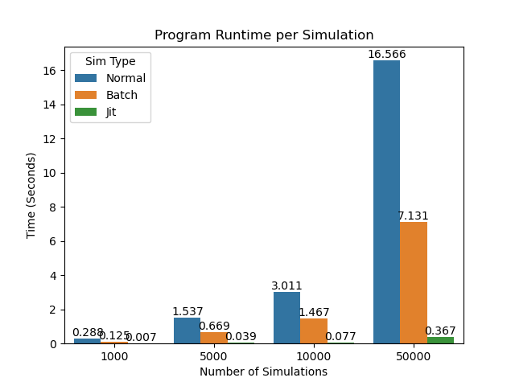

# March Madness 2022

## Purpose
The purpose of this project is to use machine learning to predict the outcome of the March Madness 2022 tournament. 
Each teams win probability is calculated using two different approaches. The first method is a Monte Carlo simulation approach
based on offensive stats. This model will return the simulated win probability between two teams based on 100k 
simulations. Afterwards the second win probability is calculated using each teams Elo rating. A weighted scheme using
the win probability from both approaches is used to calculate the probability of team A beating team B. The output of 
this file was entered into <a href="https://www.kaggle.com/c/mens-march-mania-2022">Kaggle's 2022 March Mania Competition</a>. 
Since there are 68 teams at the beginning of the tournament, there are 2,278 potential matchups. 

## Demo

## Monte Carlo Model Parameters
The Monte Carlo Simulation is based only on the offensive parameters of each team. The stats that were used for each team 
were the following:
- Pace
- Turnover Rate
- Three Point Shot Probability (What fraction of total shots were three pointers)
- Two Point Shot Percentage
- Three Point Shot Percentage
- Offensive Rebound Rate

The number of simulations between two teams was defined as the number of games played between both of them. Therefore, 100k
simulations meant 100k games between the two teams. Since each team's pace is the number of possessions per 40 minutes, 
it was used as the model's parameter for the number of iterations through each game. Pace plays an import role in quantifying
a win. The intuition behind this logic is similar to the law of large numbers. Teams with a higher pace expect to play
closer to their "normal" performance, and we expect fewer outliers. The opposite can be considered for teams with a lower pace
value. When exploring each team's pace per game, there appeared to be a roughly normal distribution as seen below.

    
    

A gaussian distributed random number was calculated using the combined pace distribution from the two teams to determine
the number of possessions each team would have for that game. 
For simplicity overtime games were excluded when calculating win probability. Three different models were created:
- Basic Iterative Model (To play one game at a time) 
- Batched Version Using Numpy Arrays (To play multiple games at a time)
- Batched Just in Time Compilation Version (To play multiple games at a time while using JIT compilation)

## Data
Data Sources:
- https://www.sports-reference.com (Via Web Scrapers in team_stats.py)
    - Used for game by game pace stats
    - Used for aggregate offensive statistics
- https://www.warrennolan.com/basketball/2022/elo (Stored ./InputData/elo_2022.csv)
  - Used for Elo ratings 
- https://www.kaggle.com/competitions/mens-march-mania-2022/data (Via Kaggle API)
  - Used for team IDs
  
## Files

## Instructions 

## Runtime 

The above plot looks at the time it takes to run N number of simulations between two teams using the three different
models created. Although the runtime will differ across systems, we can see the advantages using the JIT compilation 
model. When running 100k simulations each model had a mean win probability between the two teams within a 95% confidence
interval of each other. This validates that the models are performing similarly. Since the models are performing basically
the same, the JIT model is recommended since it takes drastically less computational time.

## Results
Overall the model performed decent within the competition finishing within the top 19% of all participants.

## Future Work
There were a few limitations that future work could help further validate this model. For example, the weighted scheme was
based solely on the 2019 March Madness results. It would be ideal to extend this model to past tournaments to see if the 
accuracy or weighted probability scheme changes. Another area for future work is the parameters of the simulated model. 
As of now, the model only took into consideration offensive statistics and ignored free throws. Another limitation was 
how the model was validated before the competition.

Free throws were ignored in the simulated model for simplicity since free throws can be difficult to quantify. Often free 
throw percentage can help determine the outcome of close games. For example, Gonzaga shot less than 75% from the free throw
line each game, which could have contributed to their struggling tournament performance. 
There are various metrics related to free throw percentage, but it would take additional time quantifying that with the
pace metric. This is because free throw quantities can change depending on the scenario. 
For example: 
- One free throw (Fouled during a made basket or non-shooting foul while other team has between 7-9 total fouls for that half and free throw is missed) 
- Two free throws (Fouled during a 2-point non made basket or non-shooting foul while other team has between 7-9 total fouls for that half and first free throw is made) 
- Three free throws (Fouled during a 3-point non made basket)

One big area for future improvement is how the model was validated. The Kaggle competition uses a log loss function based
on win probability to score submissions. This model's weighted scheme was validated using the probability of a team winning
March Madness based on the normalized betting odds provided by Sportsbook.ag. It will be interesting to adjust this error metric 
to see any changes it has on the weighting parameters.

I look forward to tackling some of these limitations for next year's competition! 